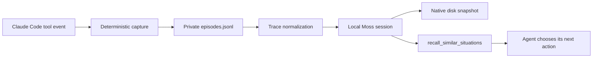

# moss-reflex

Procedural memory for coding agents: remember which actions fixed a failure, which made it worse,
and which were later reverted.

Coding agents repeatedly pay to rediscover the same repository-specific knowledge. `moss-reflex`
turns Claude Code's execution trail into local, outcome-labeled memories and exposes them through
MCP before the agent tries another fix. There is no LLM in capture, labeling, normalization,
indexing, or ranking.



## Why this is not a memory wrapper

- Outcomes come from exit codes, test-count deltas, and Git diff history. A model never grades
  itself.
- Stack traces are encoded structurally: volatile line numbers, addresses, offsets, timestamps,
  and absolute path prefixes are removed while exception types, frame functions, and relative
  module paths survive.
- The untouched tool output is stored in Moss's opaque structured payload and returned verbatim.
- Repository, language, error class, tool, outcome, and time are filterable metadata.
- Results combine Moss similarity with exponential recency decay, so fixes from the current
  dependency era outrank stale ones.
- JSONL remains the source of truth. A missing or damaged native snapshot is rebuilt locally by
  replaying it.

## Cost and network boundary

The project is designed to cost **$0**:

- Moss's Developer plan is free and local queries are unmetered.
- `moss-minilm` generates embeddings on-device; there is no embedding API bill.
- The system never calls an LLM for labeling, summarization, or retrieval.
- It opens a uniquely named session and never invokes any cloud persistence operation. The only
  application-initiated Moss network step is the SDK's required session-open credential and
  existence handshake. Documents, embeddings, queries, JSONL, and snapshots stay local.

Moss SDK releases may implement their own operational telemetry. If your threat model requires a
process-level guarantee of zero outbound packets after the handshake, enforce that at the host or
container firewall as well; this project makes no additional network calls itself.

## Install

Python 3.10 or newer is required.

```bash
git clone https://github.com/Naut1cal5/moss-reflex.git
cd moss-reflex
python -m venv .venv
source .venv/bin/activate
python -m pip install .
```

Create or use a free Moss project, then export credentials in your shell. Never commit them:

```bash
export MOSS_PROJECT_ID="your-project-id"
export MOSS_PROJECT_KEY="your-project-key"
```

Run initialization from the repository whose procedures should be remembered:

```bash
moss-reflex init
```

Initialization merges capture hooks into `.claude/settings.json` and registers the stdio
server in `.mcp.json`. Existing settings and hooks are preserved. Restart Claude Code so it picks
up the MCP server.

## MCP tools

`recall_similar_situations(query, k=5, filters=None)` returns ranked episodes with the action,
mechanical outcome, original raw trace, semantic score, and recency weight.

Filters support `$eq`, `$in`, and nested `$and` over a fixed metadata allowlist:

```json
{
  "$and": [
    {"language": {"$eq": "python"}},
    {"error_class": {"$in": ["ImportError", "ModuleNotFoundError"]}},
    {"outcome": {"$in": ["success", "resolved"]}}
  ]
}
```

`reflex_stats()` reports episode totals by outcome, error class, and tool without opening Moss or
making a network request.

## CLI

```text
moss-reflex init     merge Claude Code hook and MCP configuration
moss-reflex serve    run the stdio MCP server
moss-reflex stats    inspect the local JSONL source of truth
moss-reflex replay   discard the in-memory view and re-embed JSONL locally
```

The hook-only subcommand reads Claude Code's event JSON from stdin. Hooks append quickly; the
long-lived MCP server batches pending episodes into its session immediately before recall and
persists the updated native snapshot.

## Deterministic outcome pipeline

| Signal | Label |
| --- | --- |
| Non-zero exit or failing tests | `failure` |
| Fewer failing tests | `improved` |
| Failing tests reach zero | `resolved` |
| More failing tests | `regressed` |
| Current Git diff returns to an earlier session fingerprint | `reverted` |
| Successful exit with no prior failure delta | `success` |
| No decisive mechanical signal | `observed` |

Stop events become `completed` or `unresolved` based on the last mechanically observed test state.

## Local data and privacy

Each repository is isolated under `~/.moss-reflex/<repo-hash>/`:

```text
episodes.jsonl          append-only source of truth (mode 0600)
hook-state/             per-Claude-session test and diff state
install-id              random local namespace; prevents cloud-name collisions
snapshot/               native Moss disk snapshot
snapshot-manifest.json  indexed episode count and snapshot identity
```

Raw traces can contain source snippets, local paths, environment output, or secrets printed by a
tool. They are intentionally not altered because verbatim recall is a core feature. The directory
is private by default; do not commit or upload it. Normalized text is used only for embedding and
removes machine-specific path prefixes.

No project key, project ID, episode, snapshot, transcript, benchmark result, or generated Claude
configuration is included in this repository.

## Benchmark

The harness in [`benchmarks/`](benchmarks/) runs one task twice with memory off and on, then
reports tool calls, tokens, resolution, and wall time. It requires the runner to report real
measurements; it ships no fabricated headline number.

```bash
python benchmarks/run_benchmark.py \
  --task benchmarks/tasks/recurring-import-error.md \
  --runner './your-agent-adapter'
```

## Development

```bash
python -m pip install '.[dev]'
python scripts/check_local_only.py
ruff check .
mypy src
pytest
python -m build
```

CI scans every repository text file for disallowed remote-index operations and Moss-shaped keys
before running lint, type checks, tests, and package builds.

## License

MIT
