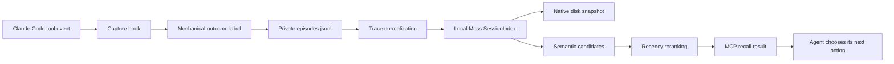

# moss-reflex

[](https://github.com/Naut1cal5/moss-reflex/actions/workflows/ci.yml)
[](https://www.python.org/)
[](LICENSE)

**Execution-grounded procedural memory for coding agents, powered locally by Moss.**

`moss-reflex` remembers what a coding agent tried, what happened, and whether the action fixed,
worsened, or reverted a recurring failure. Claude Code hooks capture tool outcomes automatically;
a local Moss session turns normalized episodes into semantic memory; and a stdio MCP server lets
the agent recall similar situations before spending another dozen tool calls on the same mistake.

No LLM participates in capture, outcome labeling, trace normalization, indexing, ranking, or
statistics.

## The problem

Coding agents have strong short-term reasoning and weak procedural continuity. A fresh session can
know every file in a repository yet still repeat last week's failed repair:

1. A test fails with a repository-specific import or build error.
2. The agent searches documentation, inspects configuration, and tries several plausible fixes.
3. One action resolves the problem; another is later reverted because it caused a regression.
4. The session ends, and the execution-grounded lesson disappears with it.
5. The next session encounters the same failure and repeats the investigation.

Traditional agent memory usually stores facts or conversation summaries. `moss-reflex` stores
**procedures grounded in execution**:

```text
context: normalized error, stack trace, failing command, and file
action:  command, edit, or tool invocation the agent attempted
outcome: mechanically observed result such as resolved, regressed, or reverted
```

The useful memory is not merely "this repository uses pytest." It is "when this exact import
failure appeared after the package-layout change, replacing the relative import resolved eight
tests, while modifying `PYTHONPATH` was later reverted."

## Project status and relationship to Moss

`moss-reflex` is an **independent MIT-licensed side project** maintained at
[`Naut1cal5/moss-reflex`](https://github.com/Naut1cal5/moss-reflex). It uses the public Moss Python
SDK but is not part of the SDK package and is not maintained as a component of the Moss runtime.

The accompanying contribution to `usemoss/moss` is a community-demo documentation entry. It links
to this repository and lists Claude Code in the example catalog; it does not copy this codebase
into the Moss SDK or change Moss production code.

## System architecture



The architecture deliberately separates durable evidence from derived search state:

- `episodes.jsonl` is the append-only source of truth.
- The normalized Moss documents and native snapshot are rebuildable derivatives.
- Raw tool output remains available in the structured payload and is never substituted with an
  LLM summary.
- The MCP server holds the hot in-process search session; short-lived hook processes only append
  evidence.

## End-to-end lifecycle

### 1. Claude Code runs a tool

`moss-reflex init` registers handlers for these events:

| Event | Why it is captured |
| --- | --- |
| `PostToolUse` | Successful tool execution and its structured response |
| `PostToolUseFailure` | Top-level execution error for a failed tool call |
| `Stop` | Whether the turn ended with a mechanically unresolved test state |

Claude Code sends the event JSON over stdin. The hook extracts the session ID, working directory,
tool name, tool input, tool response or error, file path, exit code, and recognizable test counts.
Capture warnings are written to stderr but return a non-blocking exit status so memory collection
cannot stop the coding agent.

Hooks from parallel tool calls can run concurrently. Episode writes use one append syscall, and
per-session diff/test state is guarded by an inter-process lock before it is replaced atomically.

### 2. The outcome is labeled mechanically

The labeler uses only observable signals. Its precedence is:

1. A `Stop` event becomes `completed` or `unresolved` from the last observed failing-test count.
2. Returning to an earlier Git diff fingerprint becomes `reverted`.
3. A lower failing-test count becomes `improved`, or `resolved` when the count reaches zero.
4. A higher failing-test count becomes `regressed`.
5. A non-zero exit code or positive failing-test count becomes `failure`.
6. A zero exit code or zero failing-test count becomes `success`.
7. An event without a decisive signal becomes `observed`.

This makes the label reproducible and inspectable. The agent does not get to declare its own fix
successful.

### 3. The episode is appended to JSONL

Each record contains the searchable context and the evidence needed to audit the label. A
simplified episode looks like this:

```json
{
  "id": "episode-id",
  "timestamp": "2026-07-14T23:18:04.120000+00:00",
  "repo": "repository-hash",
  "session_id": "claude-session-id",
  "context": "Traceback ... ModuleNotFoundError: package",
  "action": "Bash: {\"command\": \"pytest -q\"}",
  "outcome": "failure",
  "raw_trace": "Traceback ... ModuleNotFoundError: package",
  "normalized_context": "Traceback ... ModuleNotFoundError: package",
  "language": "python",
  "error_class": "ModuleNotFoundError",
  "tool_name": "Bash",
  "file_path": "tests/test_imports.py",
  "exit_code": 1,
  "test_before": null,
  "test_after": 3
}
```

The file is created with mode `0600`; its repository directory is created with mode `0700` where
the operating system supports POSIX permissions.

### 4. Volatile trace tokens are normalized

Generic text chunking performs poorly on stack traces because values unrelated to the underlying
failure change every run. Before embedding, `moss-reflex` replaces or shortens:

- ISO and clock timestamps
- hexadecimal memory addresses
- native memory offsets
- Python `line N` positions
- compiler-style `file:line:column` positions
- Windows and POSIX absolute path prefixes

It preserves exception classes, messages, frame function names, filenames, and relative module
paths.

Example:

```text
Before:
2026-07-14T21:22:01Z File "/Users/me/work/api/pkg/service.py", line 418, in run
ValueError: bad state at 0x7ffee12abc99 helper+0x4f

Embedded:
<timestamp> File "api/pkg/service.py", line <line>, in run
ValueError: bad state at <address> helper+<offset>
```

The original string remains untouched in `raw_trace`; normalization affects only the text used for
similarity search.

### 5. The MCP server synchronizes pending episodes

Hook processes do not reopen and warm an embedding model after every tool call. The long-lived MCP
server lazily synchronizes pending JSONL records immediately before recall:

1. Open a uniquely named `client.session()` using `moss-minilm`.
2. Restore the native local snapshot when its identity and document count match the manifest.
3. Embed only JSONL episodes added after the recorded count.
4. Save the refreshed native snapshot locally.
5. If the snapshot is missing, malformed, or inconsistent, clear the in-memory view and rebuild it
   entirely from JSONL.

All document insertion and querying happens through the returned `SessionIndex`. The application
contains no cloud-index mutation or synchronization path and never falls back to an upload.

### 6. Recall is filtered and reranked

Moss retrieves a wider semantic candidate pool: at least 12 candidates, normally `4 × k`, capped
at 100. Each hit receives an exponential recency weight with a default 30-day half-life:

```text
recency = exp(-ln(2) × age_days / 30)
final_score = 0.85 × semantic_score + 0.15 × recency
```

The server sorts by `final_score` and returns the first `k` episodes. This keeps semantic relevance
dominant while allowing a current fix to outrank an equally similar procedure from an obsolete
dependency version.

## Quick start

### Requirements

- Python 3.10 or newer
- Git
- Claude Code with project hooks and project-scoped MCP support
- A Moss project ID and key

### Install

```bash
git clone https://github.com/Naut1cal5/moss-reflex.git
cd moss-reflex
python -m venv .venv
source .venv/bin/activate
python -m pip install .
```

On Windows PowerShell:

```powershell
py -m venv .venv
.venv\Scripts\Activate.ps1
python -m pip install .
```

### Configure credentials

Create or use a free Moss project and export credentials in the shell that launches Claude Code:

```bash
export MOSS_PROJECT_ID="your-project-id"
export MOSS_PROJECT_KEY="your-project-key"
```

Do not place real credentials in `.mcp.json`, `.claude/settings.json`, `.env` files committed to
Git, screenshots, issues, or shell examples.

### Initialize a target repository

Change into the repository whose procedures should be remembered, then run:

```bash
moss-reflex init
```

Initialization merges configuration instead of replacing existing settings. It produces entries
equivalent to:

```json
{
  "hooks": {
    "PostToolUse": [
      {
        "matcher": "*",
        "hooks": [
          {"type": "command", "command": "moss-reflex hook post-tool-use"}
        ]
      }
    ],
    "PostToolUseFailure": [
      {
        "matcher": "*",
        "hooks": [
          {"type": "command", "command": "moss-reflex hook post-tool-use-failure"}
        ]
      }
    ],
    "Stop": [
      {
        "hooks": [
          {"type": "command", "command": "moss-reflex hook stop"}
        ]
      }
    ]
  }
}
```

It also merges this project-scoped MCP server into `.mcp.json`:

```json
{
  "mcpServers": {
    "moss-reflex": {
      "command": "moss-reflex",
      "args": ["serve"]
    }
  }
}
```

Restart Claude Code after initialization and approve the project-scoped MCP server when prompted.

## MCP tool reference

### `recall_similar_situations`

Search past procedures and return the original evidence.

| Argument | Type | Default | Description |
| --- | --- | --- | --- |
| `query` | string | required | Error, trace fragment, or natural-language situation |
| `k` | integer | `5` | Number of results, from 1 through 50 |
| `filters` | object or null | `null` | Allowlisted metadata constraints |

Example request:

```json
{
  "query": "pytest cannot import the package after moving src",
  "k": 5,
  "filters": {
    "$and": [
      {"language": {"$eq": "python"}},
      {"error_class": {"$in": ["ImportError", "ModuleNotFoundError"]}},
      {"outcome": {"$in": ["success", "resolved"]}}
    ]
  }
}
```

Supported fields:

| Field | Meaning |
| --- | --- |
| `repo` | Stable hash of the Git remote, or local root when no remote exists |
| `language` | Language inferred from a file suffix or known command |
| `error_class` | Parsed exception or normalized compiler failure class |
| `tool_name` | Claude Code tool that produced the episode |
| `outcome` | Mechanical label |
| `timestamp` | UTC ISO-8601 capture time |

Supported operators are `$eq`, `$in`, and nested `$and`. Unknown fields and operators are rejected
before they reach Moss.

Each result contains:

- `score`: final combined score
- `semantic_score`: original Moss similarity score
- `recency_weight`: exponential time weight
- `episode`: the complete structured record, including the raw trace and outcome evidence

### `reflex_stats`

Return counts by outcome, error class, and tool directly from JSONL. This tool does not open a Moss
session and does not need to warm the embedding model.

## CLI reference

```text
moss-reflex init     merge Claude Code hook and MCP configuration
moss-reflex serve    run the stdio MCP server
moss-reflex stats    inspect local JSONL statistics
moss-reflex replay   rebuild the native snapshot from JSONL locally
```

Examples:

```bash
moss-reflex stats
moss-reflex replay
moss-reflex serve
```

`replay` requires valid Moss credentials because it opens the local session and embedding model.
It does not upload the reconstructed data.

## Outcome labels in detail

| Label | Mechanical meaning | Typical interpretation |
| --- | --- | --- |
| `failure` | Non-zero exit or one or more failing tests | The attempted action did not resolve the task |
| `improved` | Failing-test count decreased but remains positive | Partial progress worth remembering |
| `resolved` | A prior positive failing count reached zero | Strong positive procedural evidence |
| `regressed` | Failing-test count increased | The action made the observed state worse |
| `reverted` | Git diff returned to an earlier fingerprint | A prior change was undone |
| `success` | Zero exit or zero failing tests without a prior delta | Successful execution, not necessarily a repair |
| `observed` | No decisive mechanical signal | Evidence retained without guessing |
| `completed` | Stop event with no known failing tests | Turn ended without an observed unresolved test state |
| `unresolved` | Stop event after a positive failing-test count | Turn ended while a mechanical failure remained |

Test-count extraction recognizes common output shapes such as `3 failed`, `8 passed`,
`failures: 2`, `errors=1`, and Jest-style `Tests: 1 failed, 7 passed`. Exit codes are read from
structured response fields first and then from common textual status phrases.

## Repository isolation and local persistence

Each target repository receives an isolated directory:

```text
~/.moss-reflex/<repo-hash>/
├── episodes.jsonl
├── install-id
├── hook-state/
│   ├── <claude-session>.json
│   └── <claude-session>.lock
├── snapshot/
│   └── <local-session-name>/
└── snapshot-manifest.json
```

The repository identity is the `origin` remote URL when available, otherwise the resolved Git root
path. The first 16 hexadecimal characters of its SHA-256 digest become the directory name. A
random local `install-id` is included in the Moss session name so it cannot collide with a normal
shared index name.

The manifest records the session name, indexed episode count, and format version. On startup,
snapshot restoration is accepted only when the session name matches and the restored count is no
greater than the valid JSONL episode count. A later count mismatch also triggers a local rebuild.

Malformed individual JSONL lines are skipped rather than preventing access to all valid episodes.
The valid-record counter, rather than the physical line number, controls incremental replay.

## Cost model and network boundary

The project is designed to cost **$0** for normal use:

- Moss's Developer plan is free and local queries are unmetered.
- `moss-minilm` generates document and query embeddings on-device.
- No external embedding provider is configured.
- No LLM labels, summarizes, reranks, or judges outcomes.
- JSONL and native snapshots use local disk.

The application opens a uniquely named Moss session once in the long-lived MCP process. That SDK
operation performs the required credential and existence handshake. After it returns, document
insertion and querying use the in-process `SessionIndex`; this project initiates no other network
operation and exposes no remote persistence code path.

Moss SDK releases may implement their own operational telemetry. If your policy requires a literal
packet-level guarantee of no outbound traffic after the handshake, enforce it with a host,
container, or process firewall in addition to this application's code-level boundary.

## Privacy and threat model

`moss-reflex` is intentionally local, but procedural memory can still be sensitive.

Raw tool output may contain:

- source snippets and proprietary filenames
- local usernames and absolute paths
- environment values printed by a command
- service URLs, tokens, or credentials accidentally emitted by a tool
- test fixtures containing personal or production-like data

The raw record is not redacted because verbatim retrieval is a core design requirement. Treat
`~/.moss-reflex` as sensitive developer data:

- never commit, upload, or attach it to an issue
- use full-disk encryption on developer machines
- restrict backups according to the repository's data classification
- rotate any credential that appears in a captured command or response
- delete the repository directory when decommissioning the memory

The normalized embedding text removes volatile path prefixes, but normalization is not a secret
redaction system.

The repository CI includes a local-only policy and Moss-shaped credential scanner. Before the
initial release, source files, staged changes, and built distributions were also scanned with
`detect-secrets`; dependencies were checked for published vulnerabilities; and static security
analysis reported no medium- or high-severity findings.

## Benchmark harness

[`benchmarks/run_benchmark.py`](benchmarks/run_benchmark.py) evaluates the same failing task twice:

1. run one with procedural memory disabled
2. run two with memory enabled
3. compare resolution, tool calls, tokens, and wall-clock time

The harness does not fabricate a result and does not require a paid model. You provide an agent
adapter that writes this JSON contract:

```json
{"resolved": true, "tool_calls": 14, "tokens": 18200}
```

The adapter receives:

| Environment variable | Value |
| --- | --- |
| `MOSS_REFLEX_BENCH_MODE` | `off` for run one, `on` for run two |
| `MOSS_REFLEX_BENCH_RUN` | `1` or `2` |
| `MOSS_REFLEX_BENCH_TASK` | Absolute task or fixture path |
| `MOSS_REFLEX_BENCH_RESULT` | JSON result path the adapter must write |

Run it with:

```bash
python benchmarks/run_benchmark.py \
  --task benchmarks/tasks/recurring-import-error.md \
  --runner './your-agent-adapter'
```

For a defensible comparison, keep the target repository revision, model, prompt, tool permissions,
task, and token-counting method identical. Only memory mode should change.

## Development and verification

```bash
python -m pip install '.[dev]'
python scripts/check_local_only.py
ruff check .
mypy src
pytest
python -m build
```

The current suite covers:

- trace normalization and semantic-token preservation
- deterministic test-delta labels
- applied-then-reverted diff detection
- current Claude Code failure-event input
- permission-restricted append-only storage
- corrupt-line recovery
- non-destructive, idempotent Claude/MCP configuration
- filter compilation and rejection
- verbatim structured payload recall
- native snapshot persistence and corruption recovery
- the exact public MCP tool surface

CI runs on Python 3.10 and 3.13. It checks the local-only policy before Ruff, strict mypy, pytest,
and package builds.

## Known limitations

- Outcome quality is bounded by mechanical evidence. A command that exits zero while producing a
  logically incorrect edit can still receive `success`.
- Test parsers cover common textual formats, not every test framework or localized output.
- Diff reversion detection uses tracked Git diffs; an untracked file alone does not affect the
  fingerprint.
- Repository identity changes if memory is captured before an `origin` remote is added and later
  runs use that remote.
- Recency reweighting is fixed at a 30-day half-life in the public CLI.
- Raw payloads deliberately trade redaction for forensic fidelity.
- The MCP tool must be called by the agent or its instructions; this project does not silently
  alter Claude's prompt before every failure.

## Roadmap

- Optional secret-redacted payload mode with an explicit fidelity tradeoff
- More test adapters with structured result parsing
- Repository migration tooling when the Git remote changes
- Configurable recency half-life and score weights
- Evaluation fixtures spanning Python, Rust, TypeScript, and build-system failures
- Additional agent hook adapters that preserve the same JSONL episode format

## References

- [Moss sessions](https://docs.moss.dev/docs/integrate/sessions)
- [Moss metadata filtering](https://docs.moss.dev/docs/integrate/metadata-filtering)
- [Moss structured payloads](https://docs.moss.dev/docs/reference/python/structured-payload)
- [Moss pricing and limits](https://docs.moss.dev/docs/pricing)
- [Claude Code hooks reference](https://code.claude.com/docs/en/hooks)
- [Claude Code MCP configuration](https://docs.anthropic.com/en/docs/claude-code/mcp)

## License

MIT. See [LICENSE](LICENSE).
